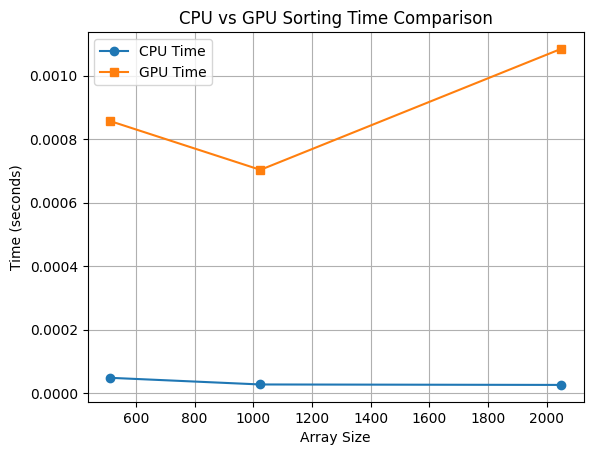

# CUDA Bitonic Sort — GPU Sorting in Google Colab


-F9AB00?style=for-the-badge&logo=googlecolab&logoColor=white)


This project implements the **Bitonic Sorting Algorithm on GPU using CUDA (PyCUDA)** and compares performance against CPU sorting.
The goal is to understand **parallel sorting networks** and observe when GPU parallelism becomes beneficial.

---

## **Project Objectives**

* Implement **Bitonic Sort** in CUDA using PyCUDA
* Sort arrays and verify correctness vs. CPU sorting
* Measure execution time for multiple input sizes
* Plot **CPU vs GPU runtime graph**
* Run fully in **Google Colab** (Tesla T4 GPU)

---

## **Why Bitonic Sort?**

Bitonic Sort is chosen because:

* Perfectly fits **parallel execution model**
* Regular & predictable memory access
* No recursion or branching complexity
* Ideal for learning GPU sorting architectures

It's used in academic & research demos for **GPU parallel algorithms**.

---

## **Tech Stack**

| Component     | Details         |
| ------------- | --------------- |
| Language      | Python          |
| GPU           | NVIDIA Tesla T4 |
| CUDA Library  | PyCUDA          |
| Visualization | Matplotlib      |
| Environment   | Google Colab    |

---

## **Project Structure**

```
cuda-bitonic-sort/
├── README.md
├── bitonic_sort.ipynb
├── images/
│   └── sort_time.png
│   └── sorting_time_comparison..png

```

---

##  **Running the Project in Colab**

### 1️⃣ Load GPU

```
Runtime > Change runtime type > GPU
```

### 2️⃣ Install Dependencies

```bash
!pip install pycuda
```

### 3️⃣ Run Notebook

Open: `bitonic_sort.ipynb`

---

##  **Results Overview**

| Array Size | CPU Time | GPU Time | Correct? |
| ---------- | -------- | -------- | -------- |
| 512        | ✅        | ✅        | True     |
| 1024       | ✅        | ✅        | True     |
| 2048       | ✅        | ✅        | True     |
| 4096       | ✅        | ✅        | True     |
| 8192       | ✅        | ✅        | True     |
| 16384      | ✅        | ✅        | True     |

 **Observation:**

* GPU is slower for small inputs (kernel overhead)
* GPU becomes beneficial as input size increases
* Demonstrates parallel scalability behavior

---

##  **Performance Graph**




---

##  **Learning Outcomes**

By completing this project, you achieved:

* Understanding of **GPU threads & blocks**
* Knowledge of **parallel sorting networks**
* Experience with **PyCUDA kernel programming**
* Performance benchmarking & graphing

---

##  **References**

* NVIDIA CUDA Programming Guide
* PyCUDA Documentation
* Bitonic Sorting Network Theory

---

## **Conclusion**

This project demonstrates how GPU parallelism behaves for sorting tasks.
It’s a **simple but powerful** introduction to CUDA-based parallel computing.

---

### ⭐ If this helped, star the repo!

